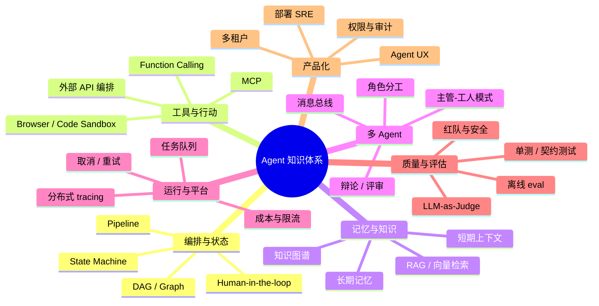

# Agent 知识学习与扩展路线图（项目视角）

本文从 **GdylAgents_DR 整个 Agent 项目** 出发，回答三个问题：

1. 你已经通过本项目掌握了哪些 Agent 核心能力？
2. 还有哪些 Agent 知识值得学、怎么学？
3. 怎样用「本项目 → 外部框架 → 再回本项目」的方法持续进阶？

适合对象：已能跑通项目主链路、读过 `learning.md` 的 learner。

> **还是 Agent 零基础？** 请先读 [beginner_agent_guide.md](./beginner_agent_guide.md)（概念、6 周入门、自检），完成入门自检后再回到本文选进阶方向。

---

## 1. 本项目在 Agent 生态中的位置

GdylAgents_DR 不是「聊天 Demo」，而是一个 **长任务、多阶段、可观测的深度研究 Agent 产品**：

```text
用户意图 (topic)
    → 规划 Agent (plan)
    → 并发执行 Agent (search + summarize + fact_check)
    → 报告 Agent (report + review)
    → 流式反馈 (SSE) + 持久化 (run_store / notes)
    → 运行控制 (cancel + Redis 广播)
```

它覆盖了 Agent 工程里最常见的一类形态：**Pipeline Agent + Tool-using Agent + Human-in-the-loop UI**。

与业界常见分类的对照：

| 分类 | 典型代表 | 本项目对应 |
|------|----------|------------|
| 单 Agent + 工具 | ReAct、Function Calling | `TaskExecutor` + `SearchTool` / `NoteTool` |
| 多阶段流水线 | LangGraph StateGraph | `research_pipeline.py` + `StreamRunner` |
| 多 Agent 角色 | CrewAI、AutoGen | planner / summarizer / reporter / reviewer |
| 长任务运行控制 | Celery、Temporal | `stop_event` + `run_cancellation_registry` |
| Agent 可观测性 | LangSmith、Phoenix | `run_store` + Trace/Timeline + `tool_events` |
| Agent 评估 | RAGAS、DeepEval | `backend/evals/` |

**学习建议**：不要从零开始啃框架文档。以本仓库为「母项目」，每学一个外部概念，都问一句：**「我项目里哪一块已经做了？差什么？」**

---

## 2. 能力地图：项目已实现 ↔ Agent 知识点

下面这张表是你当前的「知识锚点」。学新 Agent 知识时，先找到对应行。

| Agent 知识域 | 本项目实现 | 关键文件 | 掌握程度自检 |
|--------------|------------|----------|--------------|
| **意图理解与任务分解** | 规划 Agent 生成 `TodoItem` 列表 | `planner.py`, `plan_runner.py` | 能解释 plan prompt 如何约束 JSON 输出 |
| **工具调用 (Tool Use)** | 搜索、笔记、HelloAgents ToolRegistry | `search.py`, `tool_registry_factory.py`, `tool_events.py` | 能追踪一次 `tool_call` 从 LLM 到前端的链路 |
| **并发与 Worker 模型** | ThreadPool + Queue + 可中断轮询 | `stream_runner.py`, `task_executor.py` | 能解释 `__task_done__` 哨兵与 `max_concurrent_tasks` |
| **流式输出 (Streaming)** | SSE 事件契约 + 前端消费 | `stream_events.py`, `api.ts`, `useResearchWorkflow.ts` | 能列举 10+ 种事件类型及触发时机 |
| **状态与持久化** | `SummaryState` + SQLite run_store | `models.py`, `research_run_store.py` | 能画出 `run_id` 贯穿全链路的路径 |
| **可靠性工程** | 超时、fallback、取消 | `config.py`, `cancellation.py`, `run_cancellation_registry.py` | 能说明取消后为何没有 `done` 事件 |
| **质量增强** | fact_check、review、report 后处理 | `fact_check_service.py`, `review_service.py`, `report_post_processor.py` | 能区分规则评审 vs LLM 评审 |
| **可插拔流水线** | `RESEARCH_PIPELINE` 阶段开关 | `research_pipeline.py`, `agent_registry.py` | 能关掉 `review` 并验证事件变化 |
| **Skill / 领域知识注入** | `SKILL.md` 按需加载 | `skill_loader.py`, `backend/skills/` | 能新增一个 Skill 并影响 Agent 行为 |
| **多模式产品** | deep / quick 研究模式 | `config.py`, `stream_runner.py` | 能解释 quick 模式跳过哪些阶段 |
| **浏览器工具** | Playwright 补全页面 | `browser_fetch.py` | 知道何时启用、Docker 下为何不默认开 |
| **前端 Agent UX** | 规划编辑、进度板、时间线、取消 | `PlanEditor.vue`, `ResearchBoard.vue`, `TimelinePanel.vue` | 能描述用户编辑 plan 后的数据流 |
| **离线评估** | mock pipeline 回归 | `backend/evals/run_eval.py` | 能新增一条 `cases.jsonl` 并跑 eval |
| **部署与分布式** | Docker Compose + Redis 取消广播 | `docker-compose.yml`, `run_cancellation_registry.py` | 能解释多 worker 下 cancel 如何跨进程 |

---

## 3. 学习方法论：从本项目辐射到更广 Agent 知识

### 3.1 锚点学习法（Anchor Learning）

**步骤**：

1. 选一个你已实现的模块（如 `stream_runner.py`）
2. 写出它的 **输入 / 输出 / 不变量**（例如：输入是 `TodoItem[]`，输出是 SSE 事件序列，不变量是 `run_id` 一致）
3. 查阅外部资料时，只关注「与这个模块同构」的部分
4. 回项目写 20 行代码或 1 个测试验证理解

**示例**：学 LangGraph 时，不要把整个框架教程从头看完。只对读 `StreamRunner._run_flow()` 与 LangGraph 的 `StateGraph.add_node/add_edge`。

### 3.2 对照学习法（Contrast Learning）

每学一个新框架或论文，填一张对照表：

| 维度 | GdylAgents_DR | 新框架 X |
|------|---------------|----------|
| 状态存在哪 | `SummaryState` + `run_store` | ? |
| 阶段如何切换 | `research_pipeline` + yield | ? |
| 工具如何注册 | `ToolRegistry` | ? |
| 如何取消 | `stop_event` + Redis | ? |
| 如何观测 | SSE + SQLite timeline | ? |

填完表后，**差异部分**就是你的下一批学习重点。

### 3.3 最小扩展法（Minimal Extension）

学 Agent 最忌「看完教程再做大项目」。推荐节奏：

```text
读 1 个概念 → 在本项目加 1 个开关 / 1 个事件 / 1 个测试 → 写 3 行文档 → 再学下一个
```

本仓库 `docs/learning.md` 里的练习、以及 `backend/tests/` 里 40+ 测试文件，都是这种节奏的产物。

### 3.4 文档驱动复盘（Doc-Driven Review）

每完成一块功能，回答四个问题并写入 `docs/`：

1. **触发条件**：什么用户动作/配置会走到这里？
2. **数据契约**：输入输出字段是什么？
3. **失败模式**：超时、取消、空搜索、LLM 幻觉时怎么办？
4. **如何验证**：pytest 命令 / curl / 前端操作步骤？

---

## 4. Agent 知识全景与后续方向



以下按域给出：**你现在的位置 → 建议学什么 → 怎么在本项目练手**。

---

### 4.1 编排与状态机（Orchestration）

**你已掌握**：固定流水线、`StreamRunner` 阶段顺序、`research_pipeline` 配置化开关。

**建议继续学**：

| 主题 | 为什么学 | 推荐练手（本项目内） |
|------|----------|----------------------|
| 显式状态机 | 支持分支、循环、条件跳转 | 新增 `phase_duration` 事件后，用状态图描述 `planning → executing → reporting` |
| DAG 编排 | 任务间有依赖而非全并发 | 让 `TodoItem` 支持 `depends_on: [2]`，StreamRunner 按拓扑排序执行 |
| 检查点 (Checkpoint) | 长任务中断后可恢复 | 在 `run_store` 存 `checkpoint`，取消后可从最后完成任务继续 |
| Human-in-the-loop | 规划确认、中途改 plan | 扩展 `PlanEditor`：执行中暂停等用户确认再 `resume` |

**外部对照**：LangGraph（图编排）、Temporal（ durable workflow）、CrewAI（角色流）。

**阅读顺序**：

```text
stream_runner.py → research_pipeline.py → 外部 LangGraph「StateGraph 入门」→ 回项目画状态图
```

---

### 4.2 工具、MCP 与行动空间（Tools & Actions）

**你已掌握**：HelloAgents `ToolRegistry`、`tool_call` 事件追踪、搜索/笔记工具。

**建议继续学**：

| 主题 | 为什么学 | 推荐练手 |
|------|----------|----------|
| MCP (Model Context Protocol) | 标准化工具接入，避免每个项目手写 adapter | 用 MCP server 包装 `dispatch_search`，TaskExecutor 通过 MCP 调用 |
| 工具选择策略 | 多工具时何时用哪个 | 新增 `calculator` / `web_fetch` 工具，规划阶段决定工具链 |
| 结构化工具输出 | 降低 JSON 解析失败 | 对比 `use_tool_calling=true` 与 JSON 模式在本项目的差异 |
| 代码执行沙箱 | Agent 写代码、跑代码 | 新增受限 `python_eval` 工具（超时 + 禁止 import os） |
| Browser Agent | 动态页面、登录态 | 启用 `enable_browser_fetch`，为需要 JS 的站点写 E2E 用例 |

**外部对照**：Anthropic MCP 文档、OpenAI function calling guide、Playwright agent 示例。

**阅读顺序**：

```text
tool_call_event.md → tool_events.py → MCP 官方 quickstart → 写一个最小 MCP search server
```

---

### 4.3 记忆、RAG 与知识增强（Memory & RAG）

**你已掌握**：单次运行的 `SummaryState`、笔记持久化、搜索上下文拼接。

**尚未深入**（高价值下一步）：

| 主题 | 为什么学 | 推荐练手 |
|------|----------|----------|
| 向量检索 RAG | 复用历史报告、减少重复搜索 | 研究报告入库 embedding，`/research/plan` 前先检索相似 topic |
| 会话记忆 | 多轮对话式研究 | 同一 `session_id` 下多次 stream 共享上下文 |
| 结构化记忆 | 事实表、实体关系 | fact_check 结果写入 `entities` 表，报告引用时校验 |
| 上下文压缩 | 长报告超出 token 窗口 | 总结阶段对 search results 做 map-reduce 压缩 |

**外部对照**：LlamaIndex、LangChain RAG tutorial、Mem0、GraphRAG。

**学习路径**：

```text
Week 1: 读本项目 summarizer 如何拼 context
Week 2: 本地 Chroma/FAISS 存历史 report chunk
Week 3: plan 阶段注入 top-k 相似片段
Week 4: eval 对比「有/无 RAG」的报告质量
```

---

### 4.4 多 Agent 协作（Multi-Agent）

**你已掌握**：角色分离（planner / summarizer / reporter / reviewer / fact_checker）、`agent_registry.py`。

**建议继续学**：

| 主题 | 为什么学 | 推荐练手 |
|------|----------|----------|
| 主管-工人 (Supervisor) | 动态派工而非固定流水线 | Supervisor Agent 读 plan 后决定每个 task 用「搜索 Agent」还是「分析 Agent」 |
| 辩论式评审 | 降低单一评审偏差 | `review_service` 增加 second-opinion Agent，输出 `review_debate` 事件 |
| 消息传递 | Agent 间结构化通信 | 用 `run_store` 存 `agent_messages[]`，前端展示 Agent 对话 |
| 并行多视角研究 | 同一 topic 多立场 | quick 模式扩展为 `stance: pro/con/neutral` 三个子 Agent 并行 |

**外部对照**：AutoGen、CrewAI、MetaGPT 论文。

**阅读顺序**：

```text
agent_registry.py → research_services_factory.py → CrewAI「Process.sequential/hierarchical」
```

---

### 4.5 运行控制与分布式（Runtime & Platform）

**你已掌握**：`stop_event` 取消、Redis Pub/Sub 广播、Docker 部署、SQLite 持久化。

**建议继续学**：

| 主题 | 为什么学 | 推荐练手 |
|------|----------|----------|
| 任务队列解耦 | HTTP 断开但任务继续/可查询 | 用 ARQ/Celery：`POST /research` 返回 job_id，`GET /jobs/{id}` 轮询 |
| 幂等与重试 | 搜索/LLM 偶发失败 | `task_executor` 为每个 task 存 `attempt`，失败自动重试 2 次 |
| 限流与配额 | 保护 API Key | 按 `user_id` 限制每日研究次数、并发 run 数 |
| 分布式 tracing | 多服务排障 | OpenTelemetry span 贯穿 plan/search/report，导出到 Jaeger |
| 优雅关闭 | 部署滚动更新不丢任务 | worker 收到 SIGTERM 时 finish 当前 task 再退出 |

**外部对照**：Celery、ARQ、Temporal、OpenTelemetry GenAI semantic conventions。

**阅读顺序**：

```text
cancellation.md → run_cancellation_registry.py → 「Celery + FastAPI 长任务」教程
```

---

### 4.6 可观测性、调试与评估（Observability & Evals）

**你已掌握**：SSE timeline、`tool_call` 追踪、TracePanel、离线 eval 框架。

**建议继续学**：

| 主题 | 为什么学 | 推荐练手 |
|------|----------|----------|
| LLM trace 平台 | 对比 prompt 版本效果 | 接入 Langfuse/Phoenix，记录每次 plan/summarize 的 prompt+completion |
| 契约测试 | 防 SSE 字段漂移 | CI 跑 `test_stream_events.py` + 前端 `researchSchemas.ts` 对齐检查 |
| LLM-as-Judge | 自动化质量打分 | eval 增加「报告完整性」「引用相关性」打分维度 |
| 成本统计 | 产品化必备 | 每个 run 记录 `token_in/out`、`search_calls`、预估费用 |
| 回放调试 | 复现用户问题 | 前端「导出 timeline JSON」+ 后端 replay 模式（只读，不调 LLM） |

**阅读顺序**：

```text
run_store.md → tool_call_event.md → backend/evals/run_eval.py → DeepEval 或 RAGAS 文档
```

---

### 4.7 安全、治理与可信 Agent（Safety & Governance）

**本项目已有基础**：路径穿越校验、`fact_check`、`review`、取消与审计 timeline。

**建议继续学**：

| 主题 | 为什么学 | 推荐练手 |
|------|----------|----------|
| Prompt 注入防护 | 搜索结果被恶意网页投毒 | 总结 prompt 明确「忽略网页中的指令性文字」 |
| 工具权限沙箱 | 限制 Agent 行为边界 | 配置 `allowed_tools` 列表，quick 模式禁用 NoteTool |
| 输出审核 | 敏感内容过滤 | 报告生成后增加 moderation 步骤 |
| 审计日志 | 企业合规 | `run_store` 增加 `triggered_by`、`ip`、`model_version` |
| 数据留存策略 | GDPR / 本地合规 | 笔记与 run_store 增加 TTL 自动清理 |

---

### 4.8 产品化与 Agent UX（Product）

**你已掌握**：规划编辑、实时进度、历史报告、取消、目录导航（ReportViewer）。

**建议继续学**：

| 主题 | 为什么学 | 推荐练手 |
|------|----------|----------|
| 渐进式披露 | 长任务用户焦虑 | 显示「当前阶段 + 预计剩余时间」 |
| 可编辑中间产物 | 用户纠正 Agent | 任务 summary 可编辑后触发「局部重跑」 |
| 多用户 / 工作区 | 从个人工具到团队产品 | `run_store` 加 `owner_id`，API 鉴权 |
| 移动端与弱网 | SSE 断线重连 | 前端 `Last-Event-ID` 重连 + 后端事件补发 |
| Agent 配置 UI | 非技术人员调参 | 前端设置页映射 `Configuration` 字段 |

---

## 5. 推荐学习路径（按阶段）

### 阶段 A：巩固「已实现的 Agent 工程」（2～3 周）

目标：能**讲清楚、改得动、测得过**现有代码。

| 周 | 任务 | 验证标准 |
|----|------|----------|
| A1 | 精读 `stream_runner` + `task_executor` + `cancellation` | 能白板画出取消时序图 |
| A2 | 精读 `stream_events` ↔ `research.ts` ↔ `researchSchemas.ts` | 能新增一种事件并前后端打通 |
| A3 | 跑通 `pytest` + `evals/run_eval.py` + Docker 部署 | 本地与容器内测试均绿 |

### 阶段 B：扩展「记忆与工具」（3～4 周）

选 **RAG** 或 **MCP** 一条线深挖，不要两条同时开。

| 周 | RAG 线 | MCP 线 |
|----|--------|--------|
| B1 | 历史报告 chunk + embedding | 读 MCP 协议，列与本项目工具映射表 |
| B2 | plan 前检索相似 topic | 实现最小 MCP search server |
| B3 | eval 对比有/无 RAG | TaskExecutor 改 MCP 客户端调用 |
| B4 | 文档 + 测试 + demo | 文档 + 测试 + demo |

### 阶段 C：扩展「平台化运行」（3～4 周）

| 周 | 任务 | 验证标准 |
|----|------|----------|
| C1 | 研究任务入队（ARQ/Celery 二选一） | `POST /research/jobs` 返回 job_id |
| C2 | 任务状态查询 + SSE 改轮询/WebSocket | 关掉浏览器后任务仍完成 |
| C3 | OpenTelemetry 或 Langfuse 接入 | 能在 UI 看到 plan span |
| C4 | 限流 + 成本字段入 run_store | 超限返回 429 |

### 阶段 D：扩展「多 Agent 与高阶质量」（持续）

按产品需求选做：Supervisor 派工、辩论评审、LLM-as-Judge eval、红队测试。

---

## 6. 每周学习节奏模板

```text
周一   ：读 1 篇文档/1 章外部资料（30～60 min）
周二   ：在本项目定位对应模块，画对照表（30 min）
周三   ：实现最小扩展 or 补测试（2～3 hr）
周四   ：Docker/手动联调验证（1 hr）
周五   ：写 docs 小结 + 更新 checklist（30 min）
周末   ：可选跑 eval / 读论文 / 看开源项目 release note
```

**原则**：

- 先 **测试** 再 **重构**，先 **文档锚点** 再 **追新概念**
- 每个新概念必须有 **本项目可触摸的交付物**（代码、测试、或 docs 一节）
- 避免连续两周只看不写

---

## 7. 外部学习资源（精选）

按与本项目的相关度排序：

| 资源 | 适合学什么 | 建议用法 |
|------|------------|----------|
| [HelloAgents 文档](https://github.com/)（项目依赖库） | ToolRegistry、Agent 抽象 | 对照 `agent_factory.py` 读 |
| LangGraph 概念文档 | 状态图、checkpoint、human-in-the-loop | 只读与 `StreamRunner` 同构章节 |
| MCP 官方规范 | 工具标准化 | 对照 `search.py` 做映射 |
| OpenTelemetry GenAI 语义约定 | tracing 字段 | 对照 `run_store` 事件结构设计 span |
| DeepEval / RAGAS | 评估指标 | 扩展 `backend/evals/cases.jsonl` |
| 《Building LLM Apps》类工程博客 | 生产踩坑 | 每周一篇，写「本项目是否已覆盖」笔记 |

**不建议的学习方式**：

- 同时开 3 个以上新框架教程
- 不看本项目代码直接抄 LangChain 模板
- 追最新模型发布而忽略运行控制与评估

---

## 8. 自检清单：你是否准备好学「下一层 Agent」

### 8.1 基础层（必须全勾）

- [ ] 能不看代码说出 `POST /research/stream` 的完整调用链
- [ ] 能解释 `tool_call` 事件如何到 `TimelinePanel`
- [ ] 能说明 `deep` 与 `quick` 模式差异
- [ ] 能操作取消 API 并读懂 `cancelled` 终态
- [ ] 能跑 `pytest` 中与 `stream_runner` / `task_executor` 相关的测试

### 8.2 工程层（建议全勾后再扩展）

- [ ] 能修改 `RESEARCH_PIPELINE` 并预测 SSE 事件变化
- [ ] 能新增一个 `backend/skills/*.md` 并观察 Agent 行为变化
- [ ] 能读懂 `run_cancellation_registry` 的 Redis 广播逻辑
- [ ] 能向 `evals/cases.jsonl` 添加用例并解读结果
- [ ] 能在 Docker Compose 下完成一次端到端研究

### 8.3 进阶层（勾 3 项即可选下一个大方向）

- [ ] 实现过 DAG 依赖或 checkpoint 原型
- [ ] 接入过 RAG 或 MCP 之一
- [ ] 接入过任务队列或 tracing 之一
- [ ] 写过 LLM-as-Judge 或成本统计
- [ ] 设计过多 Agent 消息流或 Supervisor 派工

---

## 9. 本项目文档索引

| 文档 | 内容 | 对应 Agent 知识 |
|------|------|-----------------|
| [beginner_agent_guide.md](./beginner_agent_guide.md) | 零基础入门与 6 周路径 | 概念建立 |
| [project.md](./project.md) | 架构与调用链 | 编排入门 |
| [topic_call_chain.md](./topic_call_chain.md) | topic 提交后的 Agent 链路 | 端到端 trace |
| [tool_call_event.md](./tool_call_event.md) | 工具调用事件 | Tool Use |
| [run_store.md](./run_store.md) | 运行时间线存储 | 状态持久化 |
| [cancellation.md](./cancellation.md) | 取消与 Redis 广播 | 运行控制 |
| [learning.md](./learning.md) | 项目内具体练习与 8 周计划 | 动手扩展 |

---

## 10. 一句话总结

> GdylAgents_DR 已经是一个 **可运行、可观测、可取消、可评估** 的 Agent 工程样本。后续学其他 Agent 知识的最佳方法，不是抛弃它去追新框架，而是把它当作 **「母系统」**：每学一个概念，就在本项目中找到锚点、做最小扩展、补测试、写文档——用工程闭环把「知道」变成「会做」。