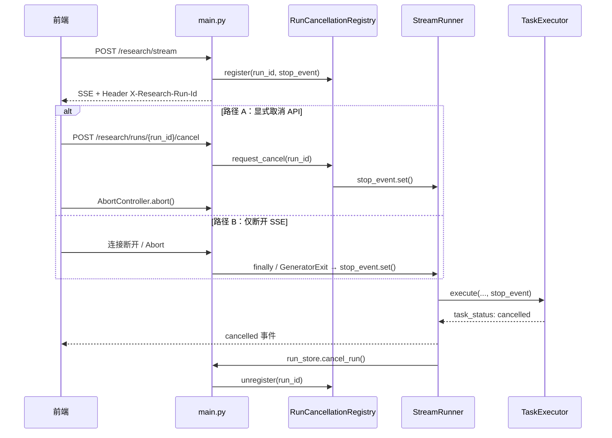
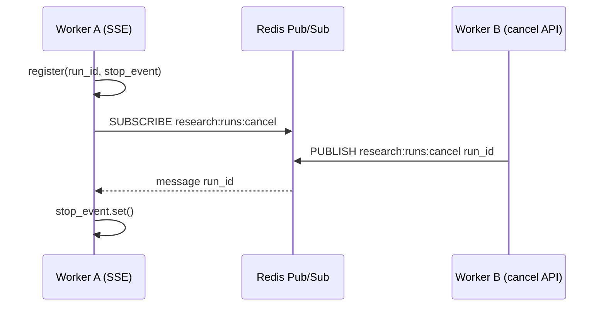

# 研究任务取消链路（Cancellation）

本文说明 GdylAgents_DR 中 **「用户取消 → 后端 worker 真停」** 的设计、代码路径、学习方法和后续扩展。

---

## 1. 为什么 Agent 项目必须做取消链路

深度研究是典型的 **长任务 Agent**：

- 一次运行可能持续数分钟
- 内部有并发 worker（搜索、总结、报告）
- 消耗 LLM token 与搜索配额

如果只在前端 `AbortController.abort()` 断开 SSE，而后端线程继续跑，会出现：

| 问题 | 后果 |
|------|------|
| 用户以为已停止 | 后台仍调 LLM / 搜索 |
| run_store 状态不准 | 长期停留在 `running` |
| 无法复现与审计 | Timeline 与真实执行不一致 |
| 多用户/多 worker 部署 | 单进程内存方案不够用 |

**取消链路的本质**：把 HTTP/SSE 连接生命周期与 Agent 执行生命周期绑在一起。

---

## 2. 当前实现的两种取消路径



### 路径 A：显式取消（推荐主路径）

1. 前端从响应头 `X-Research-Run-Id` 拿到 `run_id`
2. 用户点「取消」→ 先调 `POST /research/runs/{run_id}/cancel`
3. 再 `AbortController.abort()` 断开 SSE

优点：即使 SSE 已不稳定，也能主动通知后端。

### 路径 B：被动取消（兜底）

客户端断开 SSE 时，`main.py` 的 `event_iterator` 在 `GeneratorExit` / `finally` 中 `stop_event.set()`。

优点：实现简单，覆盖浏览器直接关页等场景。

---

## 3. 核心模块地图

| 模块 | 文件 | 职责 |
|------|------|------|
| 取消信号 | `backend/src/services/cancellation.py` | `is_cancelled` / `ensure_not_cancelled` / `ResearchCancelled` |
| 活跃运行表 | `backend/src/services/active_run_registry.py` | 进程内 `run_id → threading.Event` |
| 取消广播 | `backend/src/services/run_cancellation_registry.py` | memory / Redis Pub/Sub 跨 worker 取消 |
| 流式编排 | `backend/src/services/stream_runner.py` | 轮询 `stop_event`、跳过 final_report、发 `cancelled` |
| 单任务执行 | `backend/src/services/task_executor.py` | 搜索/总结轮询中响应取消 |
| HTTP 入口 | `backend/src/main.py` | SSE 断开处理 + `POST .../cancel` |
| 运行状态 | `backend/src/services/research_run_store.py` | `cancel_run()` → status=`cancelled` |
| SSE 契约 | `backend/src/services/stream_events.py` | `CancelledEvent`、任务 `cancelled` 状态 |
| 前端 API | `frontend/src/services/api.ts` | `cancelResearchRun()`、读 `X-Research-Run-Id` |
| 前端状态 | `frontend/src/composables/useResearchWorkflow.ts` | 取消按钮双路径调用 |

---

## 4. 关键机制（初学者必读）

### 4.1 `threading.Event` 作为取消令牌

```python
stop_event = Event()
stop_event.set()      # 请求取消
stop_event.is_set()   # 各层轮询检查
```

为什么不用布尔变量？`Event` 线程安全，适合 `StreamRunner` 主线程与 `TaskExecutor` worker 线程之间传递信号。

### 4.2 为什么搜索/总结用「短轮询」而不是一次性 `future.result(timeout=60)`

阻塞等待期间无法响应取消。当前做法：

```python
future.result(timeout=0.2)  # 每 200ms 醒来一次
ensure_not_cancelled(stop_event)
```

这是 Agent 工程里很常见的 **可中断长任务** 模式。

### 4.3 取消后不发 `done` / `final_report`

取消是一种正常结束，但不是成功结束。Timeline 里应看到：

- `status`: "研究已取消"
- `cancelled`
- 若干 `task_status: cancelled`
- **没有** `done`

### 4.4 多 worker 部署：Redis 取消广播

单进程时 `CANCEL_BROADCAST_BACKEND=memory`（默认）即可。多 uvicorn worker 或 Docker 多副本时，取消 API 与 SSE 可能落在不同进程，需要 Redis Pub/Sub：



配置：

```env
CANCEL_BROADCAST_BACKEND=redis
REDIS_URL=redis://redis:6379/0
REDIS_CANCEL_CHANNEL=research:runs:cancel
```

`POST /research/runs/{run_id}/cancel` 在广播成功时也会返回 `cancelled: true`（即使本进程未持有该 run）。

Docker Compose 已内置 `redis` 服务，backend 默认启用 Redis 广播。本地单 worker 开发可保持 `memory`。

---

## 5. API 说明

```http
POST /research/stream
→ Response Header: X-Research-Run-Id: <run_id>
→ SSE: data: {"type":"status",...}\n\n

POST /research/runs/{run_id}/cancel
→ {"run_id":"...","cancelled":true,"status":"cancelling","message":"..."}

GET /research/runs/{run_id}
→ {"status":"cancelled","events":[...]}
```

---

## 6. 本地验证方法

### 6.1 自动化测试

```bash
cd backend
uv run --extra dev --extra redis python -m pytest \
  tests/test_stream_runner_cancellation.py \
  tests/test_task_executor_cancellation.py \
  tests/test_active_run_registry.py \
  tests/test_redis_run_cancellation_registry.py \
  tests/test_research_runs_cancel_api.py -q
```

### 6.2 手动联调

1. 启动后端与前端，提交一个会跑较久的 `deep` 研究
2. 执行中点击「取消」
3. 观察：
   - 前端进度日志出现「已发送取消信号…」
   - 后端日志：`收到显式取消请求: run_id=...` 或 `客户端断开研究流...`
   - 不再持续刷 `tool_call` / `sources`
4. 查询运行记录：

```bash
curl http://localhost:8000/research/runs/<run_id>
# status 应为 cancelled
```

### 6.3 显式 API 取消（不点按钮）

```bash
# 终端 1：发起流式研究（记下响应头里的 run_id）
curl -N -X POST http://localhost:8000/research/stream \
  -H "Content-Type: application/json" \
  -d '{"topic":"AI Agent 架构"}' -D -

# 终端 2：取消
curl -X POST http://localhost:8000/research/runs/<run_id>/cancel
```

---

## 7. 学习路径（建议 3 天）

### Day 1：读懂信号传递

**阅读顺序**：

```
main.py (event_iterator)
  → stream_runner.py (_run_task_workers)
  → task_executor.py (_call_with_timeout)
```

**练习**：在 `ensure_not_cancelled` 打日志，取消一次研究，确认搜索阶段也会打印。

### Day 2：改一个行为并写测试

**推荐练习**（任选一个）：

| 练习 | 改动点 | 验证 |
|------|--------|------|
| 取消时跳过 review | `stream_runner._emit_final_report` 前检查 | 无 `review_result` |
| 取消超时 3s 告警 | `TaskExecutor` 取消后记录耗时 | 单测断言 |
| 前端展示 run_id | `ResearchBoard` 显示 `currentRunId` | UI 可见 |

### Day 3：验证 Redis 多 worker 取消

1. `docker compose up -d` 确认 `redis` 与 `backend` 健康
2. 将 backend `CMD` 改为 `--workers 2`（或起两个独立进程）
3. 发起流式研究，用 cancel API 取消，确认 `stop_event` 在持有 SSE 的 worker 上被触发
4. 阅读 `run_cancellation_registry.py` 中 `_listen_for_cancel_messages`

---

## 8. 代码阅读 Checklist

读完应能回答：

- [ ] `stop_event` 在哪创建？在哪 `set()`？
- [ ] 为什么 `TaskExecutor` 里要 `future.cancel()`？
- [ ] `cancelled` 与 `done` 事件区别？
- [ ] `run_store.status` 有哪些终态？
- [ ] 前端为何先调 cancel API 再 abort SSE？
- [ ] Redis 模式下 cancel API 为何能在本进程无 run 时仍返回 `cancelled: true`？

---

## 9. 后续扩展（按优先级）

| 优先级 | 扩展 | 学习价值 |
|--------|------|----------|
| P1 | ~~Redis 取消广播~~（已实现） | 分布式 Agent 基础 |
| P2 | `GET /research/runs` 列表 | 运行历史产品化 |
| P3 | Celery/ARQ 任务队列 | HTTP 与执行彻底解耦 |
| P4 | 取消后部分结果保留策略 | 产品策略 + 状态机 |
| P5 | OpenTelemetry  span 标记 `cancelled=true` | 可观测性 |

---

## 10. 与其他文档的关系

- 调用链总览：[topic_call_chain.md](./topic_call_chain.md)
- 运行存储：[run_store.md](./run_store.md)
- 初学者路线：[learning.md](./learning.md)

---

## 11. 一句话总结

> 取消链路 = **共享 stop_event + 可中断轮询 + 显式 cancel API + run_store 终态**。它是长任务 Agent 从 demo 走向工程的第一块「运行控制」能力；掌握它，再学任务队列和分布式取消会顺很多。