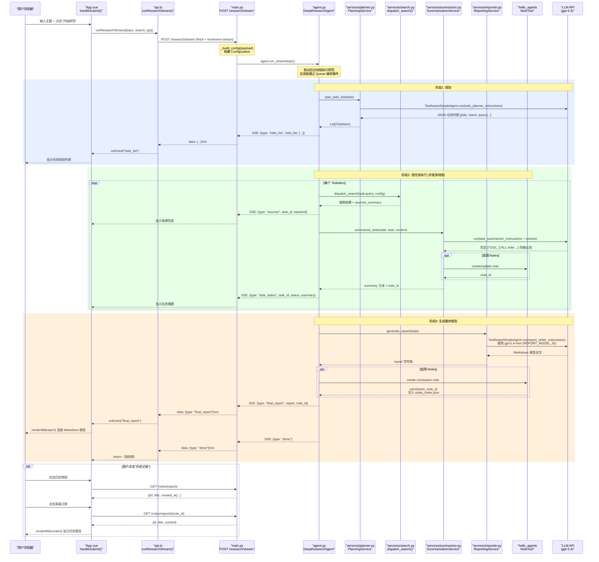
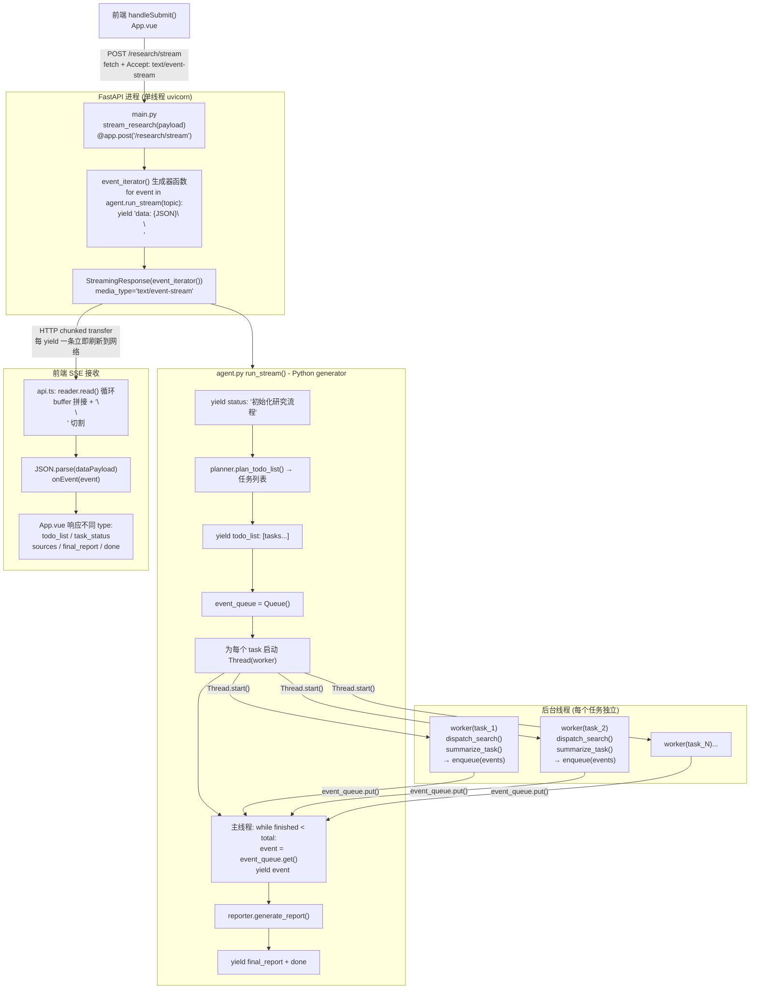
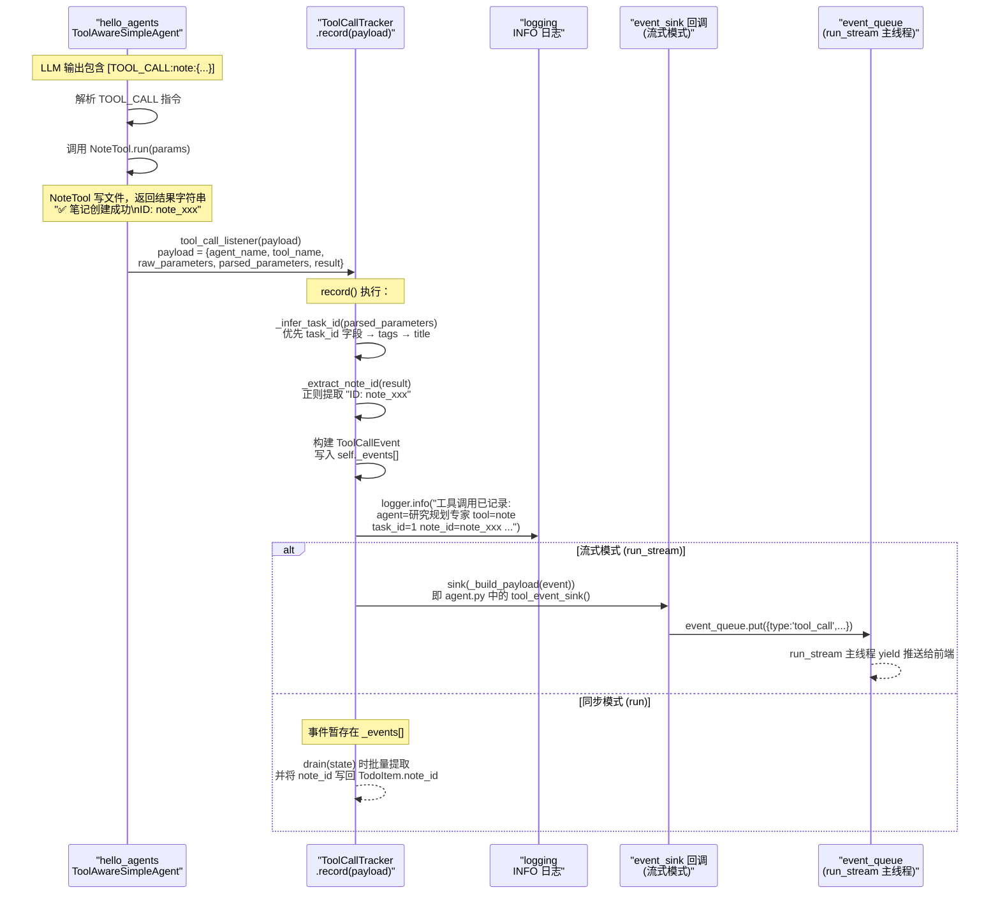

# GdylAgents_DR 架构文档

## 前后端完整调用链路

---

## 流式输出启动机制

---

## 工具调用事件记录链路

---

## SSE 事件类型说明

| 事件 type | 触发时机 | 关键字段 |
|:--|:--|:--|
| `status` | 流程各阶段开始/切换 | `message`, `step` |
| `todo_list` | 规划完成 | `tasks[]` |
| `sources` | 单个任务搜索完成 | `task_id`, `backend`, `latest_sources` |
| `task_summary_chunk` | 总结流式输出 | `task_id`, `chunk`, `stream_token` |
| `task_status` | 任务状态变更 | `task_id`, `status`, `summary`, `note_id` |
| `tool_call` | 工具调用完成 | `agent`, `tool`, `parameters`, `note_id` |
| `final_report` | 报告生成完成 | `report`, `note_id` |
| `done` | 全流程结束 | — |
| `error` | 异常发生 | `detail` |
