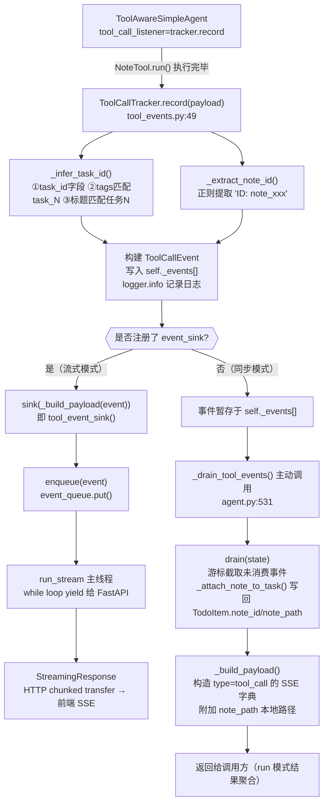

# 工具调用事件记录链路

## 概述

`ToolCallTracker` 是工具调用事件的核心收集器，负责拦截 `ToolAwareSimpleAgent` 执行工具后的回调，记录、解析并推送给前端（SSE）或返回给调用方。整条链路支持**流式**和**同步**两种工作模式。

---

## 1. 入口：Agent 注册回调

每个 `ToolAwareSimpleAgent` 实例创建时，将 `tracker.record` 注册为 `tool_call_listener`：

```python
# agent.py:155-162
return ToolAwareSimpleAgent(
    name=name,
    llm=llm,
    system_prompt=system_prompt,
    enable_tool_calling=self.tools_registry is not None,
    tool_registry=self.tools_registry,
    tool_call_listener=self._tool_tracker.record,  # ← 回调注册
)
```

当 LLM 输出包含 `[TOOL_CALL:note:{...}]` 并执行完 `NoteTool.run()` 后，框架自动调用此回调，传入以下 `payload`：

| 字段 | 说明 |
|---|---|
| `agent_name` | 发起调用的 Agent 名称 |
| `tool_name` | 被调用的工具名（如 `note`） |
| `raw_parameters` | 原始参数字符串（调试用） |
| `parsed_parameters` | 解析后的参数字典 |
| `result` | 工具返回的结果文本 |

---

## 2. 核心记录：`ToolCallTracker.record()`

> 文件：`backend/src/services/tool_events.py:49`

内部执行四步：

### ① 推断 `task_id`

调用 `_infer_task_id(parsed_parameters)`，按优先级依次检查三种来源：

```python
# tool_events.py:215-248
# 方式1：直接读取 task_id 字段
if "task_id" in parameters:
    return int(parameters["task_id"])

# 方式2：从 tags 中匹配 "task_N" 格式
for tag in parameters.get("tags", []):
    match = re.search(r"task_(\d+)", str(tag))

# 方式3：从标题中匹配 "任务N" 中文格式
match = re.search(r"任务\s*(\d+)", parameters.get("title", ""))
```

### ② 提取 `note_id`

对 `note` 工具，先从 `parsed_parameters["note_id"]` 取，失败则用正则从返回结果中提取：

```python
# tool_events.py:251-259
def _extract_note_id(self, response: str) -> Optional[str]:
    match = re.search(r"ID:\s*([^\n]+)", response)
    if match:
        return match.group(1).strip()
```

### ③ 构建 `ToolCallEvent` 并追加

```python
event = ToolCallEvent(
    id=len(self._events) + 1,
    agent=agent_name,
    tool=tool_name,
    raw_parameters=raw_parameters,
    parsed_parameters=parsed_parameters,
    result=result_text,
    task_id=task_id,
    note_id=note_id,
)
with self._lock:
    self._events.append(event)
logger.info("工具调用已记录: agent=%s tool=%s task_id=%s note_id=%s ...", ...)
```

### ④ 判断模式，决定是否立即推送

```python
# tool_events.py:99-102
sink = self._event_sink
if sink:
    sink(self._build_payload(event, step=None))  # 流式模式：立即推送
```

---

## 3. 两种消费模式

### 流式模式（`run_stream`）

`run_stream` 启动时注册实时回调：

```python
# agent.py:291-296
def tool_event_sink(event: dict[str, Any]) -> None:
    """工具调用事件实时回调：直接入队推送给前端。"""
    enqueue(event)

self._set_tool_event_sink(tool_event_sink)
```

事件流向：

```
record() → event_sink(payload)
         → tool_event_sink()
         → enqueue() → event_queue.put()
         → run_stream 主线程 yield
         → FastAPI StreamingResponse
         → 前端 SSE
```

流结束时，`_set_tool_event_sink(None)` 取消注册：

```python
# agent.py:359
finally:
    self._set_tool_event_sink(None)
```

---

### 同步模式（`run`）

不注册 `event_sink`，事件积累在 `self._events[]`。在每个执行阶段结束后，主动调用 `_drain_tool_events()`：

```python
# agent.py:531-544
def _drain_tool_events(self, state, *, step=None):
    events = self._tool_tracker.drain(state, step=step)
    if self._tool_event_sink_enabled:
        return []       # 流式模式：sink 已处理，不重复
    return events
```

`drain()` 通过游标截取增量事件，同时将 `note_id`/`note_path` 写回对应 `TodoItem`：

```python
# tool_events.py:108-137
def drain(self, state, *, step=None):
    with self._lock:
        new_events = self._events[self._cursor:]
        self._cursor = len(self._events)     # 推进游标

    if state.todo_items:
        for event in new_events:
            self._attach_note_to_task(state.todo_items, task_id, note_id)
    ...
    return payloads
```

---

## 4. 向前端推送的 SSE 载荷结构

`_build_payload()` 将内部 `ToolCallEvent` 转为 JSON 可序列化字典：

```python
# tool_events.py:174-194
payload = {
    "type": "tool_call",
    "event_id": event.id,
    "agent": event.agent,
    "tool": event.tool,
    "parameters": event.parsed_parameters,
    "result": event.result,
    "task_id": event.task_id,
    "note_id": event.note_id,
}
# 如果有笔记目录，附加本地文件路径
if event.note_id and self._notes_workspace:
    payload["note_path"] = str(Path(self._notes_workspace) / f"{event.note_id}.md")
```

---

## 5. 完整链路图



---

## 6. 关键设计要点

| 要点 | 具体实现 |
|---|---|
| **线程安全** | `threading.Lock` 保护 `_events` 和 `_cursor`，多任务 worker 线程并发 `record()` 不会竞争 |
| **task_id 推断** | 三级降级策略：直接字段 → tags 正则 → 中文标题正则，确保尽可能关联到任务 |
| **双模式切换** | `set_event_sink(None/fn)` 一个方法切换；流式模式下 `drain()` 自动返回空列表，避免重复推送 |
| **note_id 写回** | `drain()` 中调用 `_attach_note_to_task()`，使 `TodoItem.note_id` 和 `note_path` 实时更新，后续 `task_status` 事件可携带笔记路径给前端 |
| **游标机制** | `_cursor` 记录已消费位置，多次 `drain()` 只提取增量事件，避免重复消费 |
| **note_path 附加** | 构建 payload 时自动拼接 `notes_workspace / note_id.md`，前端可直接打开本地文件 |
| **可观测性字段** | 后续继续保证工具事件携带 `run_id`、`task_run_id`、`stream_token`、`timestamp`，并补充工具调用 `duration_ms`，方便 Trace / Timeline 面板排查慢调用 |

---

## 7. 涉及文件索引

| 文件 | 核心内容 |
|---|---|
| `backend/src/services/tool_events.py` | `ToolCallEvent` 数据结构、`ToolCallTracker` 全部逻辑 |
| `backend/src/agent.py` | Agent 创建与回调注册、`run_stream` 流式事件队列、`_drain_tool_events` |
| `backend/src/services/summarizer.py` | 总结 Agent 调用（触发工具调用的上游） |
| `backend/src/models.py` | `TodoItem`（含 `note_id`、`note_path` 字段） |
